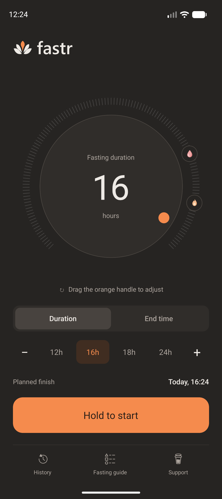
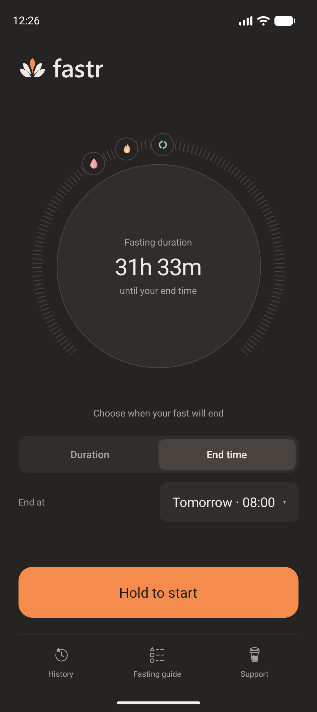
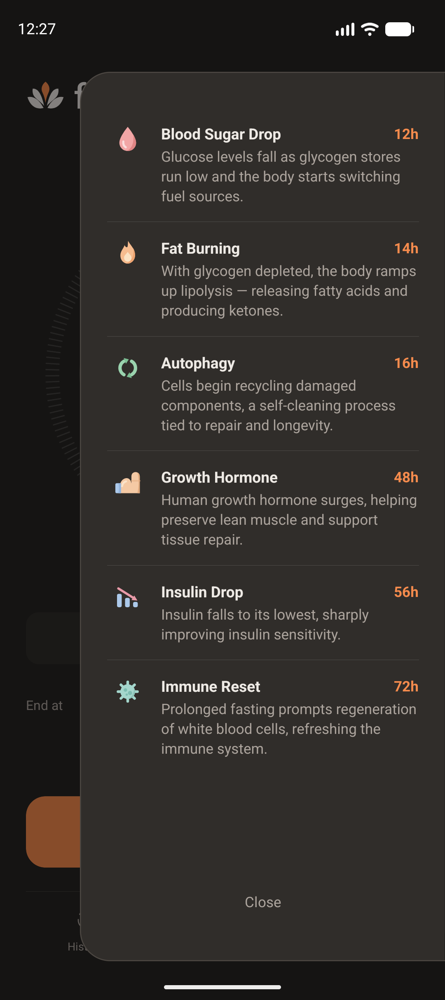

# FastR

A calm, minimal intermittent-fasting timer for Android, built with React Native.

FastR does one thing: it times your fasts. Pick how long you want to fast (or when you want to stop), hold the button to start, and watch the gauge fill as you pass the milestones along the way. No accounts, no ads, no tracking — everything stays on your device.

<p align="center">
  
  
  
  
</p>

## Features

- **Two ways to plan a fast**
  - **Duration** — drag the orange handle around the dial, use the `−` / `+` steppers, or tap a preset (12h, 16h, 18h, 24h).
  - **End time** — pick the day, hour and minute on iOS-style scroll wheels, up to a week ahead.
- **Milestone gauge** — icons on the ring mark what happens as a fast progresses and light up as you reach them:

  | Milestone        | Hours in |
  | ---------------- | -------- |
  | Blood Sugar Drop | 12h      |
  | Fat Burning      | 14h      |
  | Autophagy        | 16h      |
  | Growth Hormone   | 48h      |
  | Insulin Drop     | 56h      |
  | Immune Reset     | 72h      |

- **Fasting guide** — a short explanation of every milestone.
- **History** — completed fasts with total count, average duration, targets met and a chart of recent fasts. Entries can be selected and deleted.
- **Survives restarts** — a running fast keeps going if the app is closed or the phone restarts.
- **Private by design** — data is stored only on the device (AsyncStorage); nothing leaves the phone.


## Getting started

### Prerequisites

- Node.js **22.11** or newer
- A working React Native Android environment (JDK, Android SDK, an emulator or a device with USB debugging) — see the [React Native environment setup guide](https://reactnative.dev/docs/set-up-your-environment)

### Run it

```bash
npm install
npm start          # starts Metro
npm run android    # in a second terminal: builds and installs the debug app
```

An `ios/` project is included, but the app is developed and released for Android; iOS builds are not actively maintained.


## Support

FastR is free and built in spare time. If it helps you, you can [buy me a coffee](https://buymeacoffee.com/rootlevelit).
